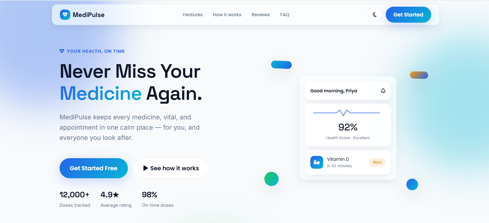

# MediPulse — Smart Personal Health Companion

> A premium, fully client-side personal health management application with smart medicine reminders, health analytics, family profiles, and zero backend dependency.

---

## 🚀 Live Preview

👉 **Try MediPulse Online:**  
[Launch MediPulse](https://medipulse01.netlify.app/)



---

# Features

## 🏠 Dashboard

- Live **Health Score** ring based on medicine adherence, water intake, sleep, and mood
- Next Medicine card with today's medication schedule
- Today's Timeline for medicines and appointments
- Water intake quick log (+250 ml) with customizable goals
- Quick Action shortcuts
- Upcoming Appointment widget
- Real-time health summary

---

## 💊 Medicine Manager

- Add, edit, and delete medicines
- Dosage management
- Medicine forms:
  - Tablet
  - Capsule
  - Syrup
  - Injection
  - Drops
- Food timing support
- Daily / Weekly / As Needed schedules
- Automatic stock tracking
- Low-stock alerts

---

## 🔔 Smart Reminders

- Today's medicines
- Upcoming reminders
- Reminder history
- Mark medicine as:
  - ✅ Taken
  - ❌ Skipped
  - ⏰ Snoozed
- Undo accidental actions
- Live adherence percentage
- Weekly missed-dose counter
- Medication streak tracking

---

## ❤️ Health Tracker

Track important health metrics including:

- Blood Pressure
- Blood Sugar
- Weight
- Sleep Duration
- Mood
- Water Intake

Features include:

- Color-coded health indicators
- Combined health timeline
- Delete recorded entries
- Daily wellness monitoring

---

## 🗓️ Calendar

- Interactive monthly calendar
- Medicine schedule indicators
- Appointment indicators
- Click any day to view medicines
- Daily appointment overview

---

## 🩺 Appointments

Manage doctor appointments with:

- Doctor Name
- Department
- Hospital
- Appointment Date
- Notes

Additional Features:

- Upcoming appointments
- Past appointments
- Mark Completed
- Cancel appointments

---

## 📈 Analytics

Responsive Chart.js visualizations:

- 📈 14-Day Health Score Trend
- 💊 Medicine Adherence Trend
- 📊 Adherence by Medicine
- ⚖️ Weight Progress Trend

Theme-aware charts with responsive layouts.

---

## 🧾 Reports & Export

- Daily Reports
- Weekly Reports
- Monthly Reports
- Export health data to CSV
- Browser-friendly print reports

---

## 👨‍👩‍👧 Family Profiles

Support for multiple family members.

Each profile maintains separate:

- Medicines
- Health Logs
- Reminders
- Appointments
- Emergency Information
- Reports

Instant profile switching without mixing data.

---

## 🚑 Emergency Information

Store important emergency details:

- Blood Group
- Allergies
- Chronic Conditions
- Emergency Contacts
- Current Medicines
- Printable Emergency Card

---

## 🙋 Profile

Manage:

- Personal Information
- Height
- Date of Birth
- Gender
- Daily Water Goal

Also includes:

- Daily Challenge
- Achievement System
- Profile synchronization

---

## ⚙️ Settings

- Light / Dark Theme
- Accessibility Font Sizes
- Notification Preferences
- Backup Data (JSON)
- Restore Backup
- Reset All Data

---

## 🎨 Design

- Modern Glassmorphism UI
- Smooth Animations
- Responsive Layout
- Desktop, Tablet & Mobile Support
- Dark & Light Themes
- Space Grotesk + Poppins + Inter Typography
- Collapsible Sidebar
- Print-optimized layouts

---

# Folder Structure

```text
MediPulse/
├── index.html
├── css/
│   ├── variables.css
│   ├── themes.css
│   ├── global.css
│   ├── components.css
│   ├── dashboard.css
│   ├── animations.css
│   ├── responsive.css
│   └── <page>.css
│
├── js/
│   ├── core/
│   │   ├── store.js
│   │   ├── eventBus.js
│   │   └── seedData.js
│   │
│   ├── modules/
│   ├── app-shell.js
│   ├── app.js
│   └── animations.js
│
├── pages/
│   ├── dashboard.html
│   ├── medicines.html
│   ├── reminders.html
│   ├── health.html
│   ├── calendar.html
│   ├── appointments.html
│   ├── analytics.html
│   ├── reports.html
│   ├── family.html
│   ├── emergency.html
│   ├── profile.html
│   └── settings.html
│
├── assets/
├── screenshot.PNG
└── README.md
```

---

# Installation

No build tools or npm installation required.

### Clone the repository

```bash
git clone https://github.com/varunGit2327/MediPulse.git
```

### Open project

```bash
cd MediPulse
```

### Serve locally

```bash
# Python
python3 -m http.server 8000

# Node
npx http-server .
```

Or simply open using **VS Code Live Server**.

Visit:

```
http://localhost:8000
```

All application data is securely stored in the browser using **Local Storage**, ensuring complete privacy with no backend dependency.

---

# Technologies Used

| Purpose | Technology |
|----------|------------|
| Structure | HTML5 |
| Styling | CSS3 (Glassmorphism, Grid, Flexbox) |
| Logic | Vanilla JavaScript (ES6+) |
| Charts | Chart.js |
| Icons | Font Awesome 6 |
| Animations | GSAP + ScrollTrigger |
| Fonts | Space Grotesk, Poppins, Inter |
| Storage | Browser Local Storage |

---

# Future Enhancements

- 🔔 Push notifications using Service Workers
- ☁️ Cloud synchronization across multiple devices
- 🌍 Multi-language support
- 💊 Medication interaction warnings
- ⌚ Wearable & health-app integrations
- 🤖 AI-powered health insights and recommendations
- 📱 Progressive Web App (PWA) support
- 🩺 Doctor & caregiver shared access
- 📊 Advanced health trend predictions
- 📅 Smart recurring medication scheduling

---

# Why MediPulse?

MediPulse is designed to simplify personal healthcare by combining medicine management, health tracking, reminders, appointments, analytics, and emergency information into a single modern web application.

Unlike traditional health trackers, MediPulse offers:

- 💙 Fully client-side architecture
- 🔒 Privacy-first approach (no backend required)
- 📈 Interactive analytics and visual reports
- 👨‍👩‍👩‍👧 Multiple family profile support
- 📱 Responsive interface for every device
- 🎨 Modern Glassmorphism UI
- ⚡ Fast and lightweight performance

---

# Browser Support

MediPulse works seamlessly on all modern browsers.

| Browser | Supported |
|----------|-----------|
| Google Chrome | ✅ |
| Microsoft Edge | ✅ |
| Mozilla Firefox | ✅ |
| Brave | ✅ |
| Opera | ✅ |
| Safari | ✅ |

---

# Data Privacy

Your privacy comes first.

✔ No backend server

✔ No account required

✔ No cloud storage

✔ No personal information is shared

✔ Everything stays inside your browser using Local Storage

---

# Performance

- ⚡ Fast loading
- 💾 No database required
- 📱 Fully responsive
- 🌙 Dark & Light mode
- 🖨 Print-friendly reports
- 📊 Optimized Chart.js visualizations
- ♿ Accessibility-friendly UI

---

# 🤝 Contributing

Contributions are welcome!

If you'd like to improve MediPulse, feel free to fork the repository and submit a Pull Request.

### Steps

1. Fork the repository

2. Create your feature branch

```bash
git checkout -b feature/my-feature
```

3. Commit your changes

```bash
git commit -m "Add my feature"
```

4. Push the branch

```bash
git push origin feature/my-feature
```

5. Open a Pull Request

---

# License

Released under the **MIT License**.

You are free to use, modify, and distribute this project.

---

# 👨‍💻 Author

Developed by **Varun Kumar**

### Connect with me

- 🌐 **Live Demo:** https://medipulse01.netlify.app
- 💻 **GitHub:** https://github.com/varunGit2327

---
Thank you for checking out **MediPulse**.

If you like this project, don't forget to **⭐ Star** the repository and share it with others!